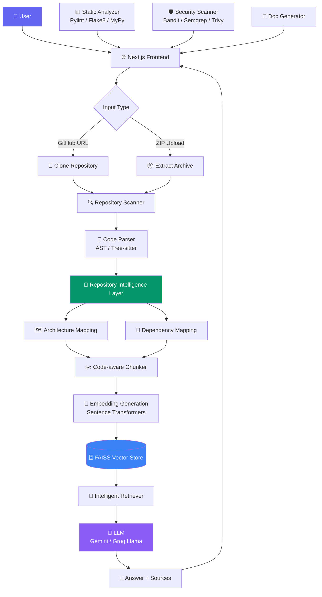
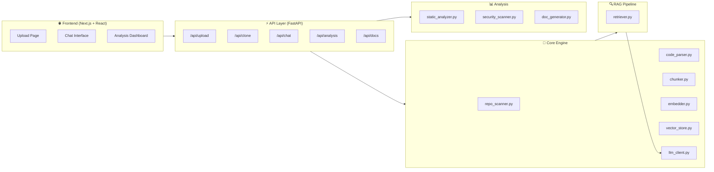
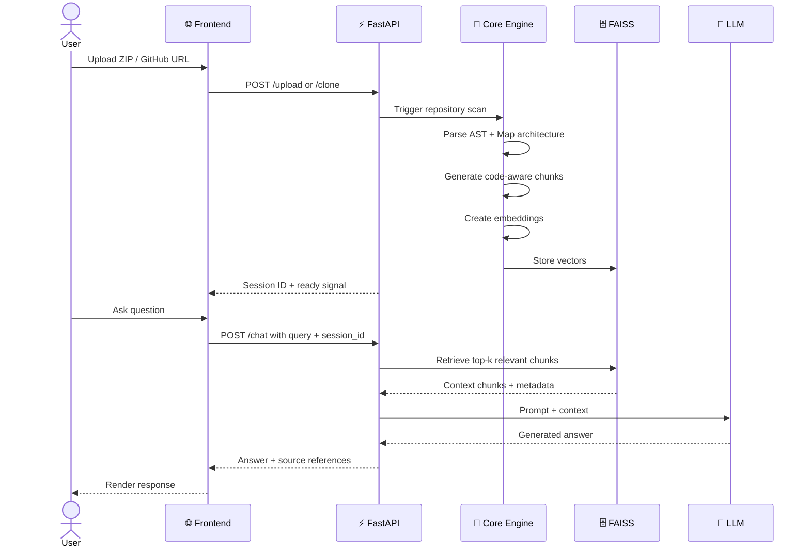

## 📌 Overview

**RepoMind AI** is a production-grade, AI-powered Software Engineering Assistant that transforms how developers interact with large codebases. Instead of spending hours reading through files and chasing dependencies, you simply **upload a repository and ask questions in plain English**.

RepoMind builds a deep structural understanding of your repository through multi-layered analysis — parsing, architecture mapping, dependency resolution, and intelligent retrieval — before answering your questions with pinpoint accuracy using **Retrieval-Augmented Generation (RAG)**.

Whether you're onboarding to a new project, conducting a code review, or searching for security vulnerabilities, RepoMind AI is your always-on engineering co-pilot.

<br/>

---

## 💡 Why RepoMind AI?

| Challenge | Without RepoMind | With RepoMind |
|---|---|---|
| 📂 **New codebase onboarding** | Days of reading files and docs | Minutes with targeted Q&A |
| 🏗️ **Architecture understanding** | Manual trace through call stacks | Instant visual + textual explanation |
| 🔍 **Code Review** | Painstakingly manual | AI-guided issue detection |
| 🛡️ **Security Auditing** | Specialized tools + expert review | Automated scan + natural language report |
| 📝 **Documentation** | Time-consuming to write | Auto-generated from source |
| 🔗 **Dependency tracking** | grep + custom scripts | Automated dependency graph |

<br/>

> [!IMPORTANT]
> RepoMind AI is not a simple code search engine. It **builds semantic understanding** of your repository through AST parsing, architecture mapping, and code-aware chunking before answering your questions.

<br/>

---

## ✨ Features

<table>
<tr>
<td width="50%">

### 📥 Repository Ingestion
- ✅ Upload via **GitHub URL** (public repos)
- ✅ Upload via **ZIP file** (any codebase)
- ✅ Automatic extraction & validation
- ✅ Multi-language support

</td>
<td width="50%">

### 🧠 Intelligence Layer
- ✅ **AST-based** code parsing
- ✅ **Tree-sitter** multi-language parsing
- ✅ Architecture & dependency mapping
- ✅ Code-aware semantic chunking

</td>
</tr>
<tr>
<td>

### 🔍 RAG Pipeline
- ✅ Sentence Transformer **embeddings**
- ✅ **FAISS** vector store for fast retrieval
- ✅ Intelligent context retrieval
- ✅ Dual LLM support (Gemini / Groq Llama)

</td>
<td>

### 🔬 Static Analysis
- ✅ **Pylint** code quality analysis
- ✅ **Flake8** style enforcement
- ✅ **MyPy** type checking
- ✅ Structured issue reporting

</td>
</tr>
<tr>
<td>

### 🛡️ Security Scanning
- ✅ **Bandit** — Python vulnerability scan
- ✅ **Semgrep** — Pattern-based SAST
- ✅ **Trivy** — Dependency CVE scanning
- ✅ Natural language vulnerability explanations

</td>
<td>

### 📚 Documentation & Chat
- ✅ Auto-generate function/module docs
- ✅ Architecture explanation in plain English
- ✅ Code review assistance
- ✅ Interactive repository chat

</td>
</tr>
</table>

<br/>

---

## 🏗️ Architecture

### System Flow



### Component Architecture



<br/>

---

## 🔄 Workflow



<br/>

---

## 🛠️ Tech Stack

<table>
<tr>
<th>Layer</th>
<th>Technology</th>
<th>Purpose</th>
</tr>
<tr>
<td><b>🖥️ Frontend</b></td>
<td>


</td>
<td>UI, chat interface, analysis dashboard</td>
</tr>
<tr>
<td><b>⚡ Backend</b></td>
<td>


</td>
<td>REST API, session management, orchestration</td>
</tr>
<tr>
<td><b>🤖 AI / LLM</b></td>
<td>


</td>
<td>Answer generation, summarization, explanations</td>
</tr>
<tr>
<td><b>🔢 Embeddings</b></td>
<td>Sentence Transformers</td>
<td>Convert code chunks into semantic vectors</td>
</tr>
<tr>
<td><b>🗄️ Vector DB</b></td>
<td>


</td>
<td>Efficient similarity search over code embeddings</td>
</tr>
<tr>
<td><b>🌳 Code Parsing</b></td>
<td>AST, Tree-sitter</td>
<td>Multi-language syntax analysis and structure extraction</td>
</tr>
<tr>
<td><b>📊 Static Analysis</b></td>
<td>Pylint, Flake8, MyPy</td>
<td>Code quality, style, and type checking</td>
</tr>
<tr>
<td><b>🛡️ Security</b></td>
<td>Bandit, Semgrep, Trivy</td>
<td>Vulnerability detection and CVE scanning</td>
</tr>
<tr>
<td><b>🐳 DevOps</b></td>
<td>


</td>
<td>Containerized deployment</td>
</tr>
</table>

<br/>

---

## 📂 Folder Structure

```
RepoMind-AI/
│
├── 📁 api/                         # FastAPI route handlers
│   ├── upload.py                   # ZIP file upload & extraction
│   ├── clone_repo.py               # GitHub URL cloning
│   ├── chat.py                     # RAG-powered chat endpoint
│   ├── analysis.py                 # Static & security analysis
│   ├── docs.py                     # Documentation generation
│   └── scanner.py                  # Repository scan trigger
│
├── 📁 core/                        # Core intelligence engine
│   ├── repo_scanner.py             # File discovery & classification
│   ├── code_parser.py              # AST / Tree-sitter parsing
│   ├── chunker.py                  # Code-aware semantic chunking
│   ├── embedder.py                 # Sentence Transformer embeddings
│   ├── vector_store.py             # FAISS index management
│   ├── llm_client.py               # Gemini / Groq LLM abstraction
│   └── doc_generator.py            # Auto-documentation logic
│
├── 📁 rag/                         # Retrieval-Augmented Generation
│   └── retriever.py                # Query -> context retrieval pipeline
│
├── 📁 analysis/                    # Code analysis modules
│   ├── static_analyzer.py          # Pylint, Flake8, MyPy runner
│   └── security_scanner.py         # Bandit, Semgrep, Trivy runner
│
├── 📁 models/                      # Pydantic data models
│   ├── request_models.py           # API request schemas
│   └── response_models.py          # API response schemas
│
├── 📁 utils/                       # Shared utility functions
│   ├── cache.py                    # In-memory session cache
│   ├── file_utils.py               # File I/O helpers
│   └── logger.py                   # Logging configuration
│
├── 📁 data/                        # Runtime data (gitignored)
│   ├── uploads/                    # Uploaded repositories
│   └── faiss_index/                # FAISS vector indices
│
├── 📁 frontend/                    # Next.js frontend application
│   ├── 📁 pages/                   # Next.js page routes
│   │   ├── index.js                # Upload page (home)
│   │   ├── chat.js                 # Repository chat interface
│   │   └── analysis.js             # Analysis results dashboard
│   ├── 📁 components/              # Reusable React components
│   │   └── Layout.js               # App layout with sidebar
│   ├── 📁 utils/                   # Frontend utilities
│   │   └── api.js                  # Axios API client
│   ├── 📁 styles/                  # Global CSS styles
│   ├── 📁 public/                  # Static assets
│   ├── next.config.mjs             # Next.js configuration
│   └── Dockerfile                  # Frontend Docker image
│
├── 📁 tests/                       # Test suite
├── 📁 backend/                     # Additional backend utilities
│
├── main.py                         # FastAPI application entry point
├── config.py                       # Application configuration
├── requirements.txt                # Python dependencies
├── Dockerfile                      # Backend Docker image
├── docker-compose.yml              # Full-stack Docker orchestration
├── .env.example                    # Environment variables template
└── README.md                       # You are here!
```

<br/>

---

## 🚀 Installation

### Prerequisites

| Requirement | Version | Check |
|---|---|---|
| Python | >= 3.11 | `python --version` |
| Node.js | >= 18.x | `node --version` |
| npm | >= 9.x | `npm --version` |
| Git | Latest | `git --version` |
| Docker *(optional)* | Latest | `docker --version` |

---

### Option 1 — Local Development

#### 1️⃣ Clone the Repository

```bash
git clone https://github.com/prajwal5065/RepoMind-AI.git
cd RepoMind-AI
```

#### 2️⃣ Backend Setup

```bash
# Create and activate virtual environment
python -m venv venv

# Windows
venv\Scripts\activate

# macOS / Linux
source venv/bin/activate

# Install Python dependencies
pip install -r requirements.txt
```

#### 3️⃣ Frontend Setup

```bash
cd frontend
npm install
cd ..
```

#### 4️⃣ Configure Environment Variables

```bash
cp .env.example .env
# Edit .env with your API keys
```

#### 5️⃣ Run the Project

```bash
# Terminal 1 — Start backend
uvicorn main:app --reload --host 0.0.0.0 --port 8000

# Terminal 2 — Start frontend
cd frontend && npm run dev
```

Open **http://localhost:3000** in your browser.

---

### Option 2 — Docker Compose (Recommended for Production)

```bash
# Clone and configure
git clone https://github.com/prajwal5065/RepoMind-AI.git
cd RepoMind-AI
cp .env.example .env  # Edit with your API keys

# Build and launch all services
docker compose up --build
```

| Service | URL |
|---|---|
| 🌐 Frontend | http://localhost:3000 |
| ⚡ Backend API | http://localhost:8000 |
| 📖 API Docs | http://localhost:8000/docs |

<br/>

---

## 🔑 Environment Variables

Create a `.env` file in the project root:

```env
# ─────────────────────────────────────────────
# 🤖 AI / LLM Configuration
# ─────────────────────────────────────────────

# Google Gemini API Key
# Get yours at: https://ai.google.dev/
GEMINI_API_KEY=your_gemini_api_key_here

# Groq API Key (for Llama models)
# Get yours at: https://console.groq.com/
GROQ_API_KEY=your_groq_api_key_here

# ─────────────────────────────────────────────
# 🗄️ Storage Configuration
# ─────────────────────────────────────────────

FAISS_INDEX_PATH=data/faiss_index
UPLOAD_DIR=data/uploads

# ─────────────────────────────────────────────
# ⚙️ Application Settings
# ─────────────────────────────────────────────

# Backend API URL (used by frontend)
NEXT_PUBLIC_API_URL=http://localhost:8000
```


<br/>

---

## ▶️ Running the Project

### Development Mode

```bash
# Backend — hot reload enabled
uvicorn main:app --reload

# Frontend — hot reload enabled
cd frontend && npm run dev
```

### Production Mode

```bash
# Backend
uvicorn main:app --host 0.0.0.0 --port 8000 --workers 4

# Frontend
cd frontend
npm run build
npm run start
```

### API Documentation

Once the backend is running, visit:
- **Swagger UI**: http://localhost:8000/docs
- **ReDoc**: http://localhost:8000/redoc

<br/>

---

## 💬 Example Questions You Can Ask

Once you've uploaded a repository, try these in the chat:

```
🏗️  Architecture
─────────────────────────────────────────────
"What is the overall architecture of this project?"
"How is the codebase structured? What are the main modules?"
"What design patterns are used in this repository?"

🔍  Code Understanding
─────────────────────────────────────────────
"How does authentication work in this project?"
"Explain the database schema and its relationships."
"What does the PaymentService class do?"
"Trace the flow of a user login request from frontend to database."

🔗  Dependencies
─────────────────────────────────────────────
"What external libraries does this project depend on?"
"Which modules depend on the UserRepository?"
"Are there any circular dependencies?"

🛡️  Security & Quality
─────────────────────────────────────────────
"Are there any SQL injection vulnerabilities?"
"What are the main code quality issues in this repo?"
"Are there any hardcoded secrets or credentials?"

📝  Documentation
─────────────────────────────────────────────
"Generate documentation for the api/users.py module."
"Summarize what this repository does in 3 sentences."
"Create a developer onboarding guide for this codebase."

🐛  Debugging
─────────────────────────────────────────────
"Where could a race condition occur in this codebase?"
"Find functions that are missing error handling."
"What happens if the database connection fails?"
```

<br/>

---

## 📸 Screenshots

<table>
<tr>
<td align="center" width="50%">

**Upload Page**

*Drag and drop a ZIP or paste a GitHub URL to analyze any repository.*

</td>
<td align="center" width="50%">

**Repository Chat**

*Ask natural language questions and get code-aware answers with source references.*

</td>
</tr>
<tr>
<td align="center" width="50%">

**Analysis Dashboard**

*View static analysis results, security vulnerabilities, and code quality metrics.*

</td>
<td align="center" width="50%">

**LLM Provider Switching**

*Switch between Google Gemini and Groq Llama on the fly via the sidebar.*

</td>
</tr>
</table>

> [!NOTE]
> The UI is actively in development. Screenshots will be added as the interface stabilizes.

<br/>

---

## 🔮 Future Improvements

| Feature | Status | Description |
|---|---|---|
| 🌍 **Public Repo Support** | 🔄 Planned | Analyze any public GitHub repo by URL without authentication |
| 🔐 **Private Repo OAuth** | 🔄 Planned | GitHub OAuth integration for private repositories |
| 📊 **Dependency Graph UI** | 🔄 Planned | Interactive visual dependency map |
| 💾 **Persistent Sessions** | 🔄 Planned | Save and reload analysis sessions across browser restarts |
| 🌐 **Multi-language Support** | 🔄 Planned | Full support for JavaScript, TypeScript, Go, Rust, Java |
| 🤝 **Team Collaboration** | 🔄 Planned | Share repository analysis sessions with teammates |
| 📤 **Export Reports** | 🔄 Planned | Export analysis as PDF, Markdown, or HTML reports |
| 🔌 **VS Code Extension** | 🔄 Planned | IDE-native RepoMind assistant |
| 🧩 **Plugin System** | 🔄 Planned | Community-extensible analysis plugins |
| 📡 **Webhook Support** | 🔄 Planned | Auto-analyze on new commits via GitHub webhooks |

<br/>

---

## 🧩 Challenges Solved

> [!NOTE]
> These are real engineering challenges tackled during development.

**1. Code-Aware Chunking**
Standard text chunking destroys code semantics. RepoMind uses AST-aware chunking that respects function and class boundaries, ensuring retrieved context is always syntactically complete and meaningful.

**2. Dual LLM Abstraction**
Supporting both Google Gemini and Groq Llama through a single unified interface required a clean provider abstraction layer that handles different API schemas, token limits, and error modes transparently.

**3. Large Repository Handling**
Repositories with thousands of files require intelligent scanning prioritization. RepoMind ranks files by relevance (entry points, core modules) and applies file-type filtering to avoid embedding documentation or binary noise.

**4. Context Window Optimization**
Fitting the most relevant code into the LLM's context window required a hybrid retrieval strategy combining dense vector search (FAISS) with structural metadata filtering (file type, module name, function scope).

**5. Multi-Tool Analysis Orchestration**
Running Pylint, Flake8, MyPy, Bandit, and Semgrep concurrently without conflicts — and normalizing their heterogeneous output formats into a unified report — required careful subprocess management and output schema design.

<br/>

---

## 🌟 Why This Project Is Different

| Feature | RepoMind AI | GitHub Copilot | ChatGPT Code | Sourcegraph |
|---|:---:|:---:|:---:|:---:|
| Full repo semantic understanding | ✅ | ❌ | ❌ | Partial |
| No GitHub account required | ✅ | ❌ | ✅ | ❌ |
| Integrated security scanning | ✅ | ❌ | ❌ | ❌ |
| Static analysis reports | ✅ | ❌ | ❌ | Partial |
| Auto documentation generation | ✅ | Partial | Partial | ❌ |
| Open source and self-hosted | ✅ | ❌ | ❌ | Partial |
| Multi-LLM provider support | ✅ | ❌ | ❌ | ❌ |
| ZIP file upload support | ✅ | ❌ | ❌ | ❌ |

<br/>

---

## 🤝 Contributing

Contributions are what make open source amazing! Any contribution you make is **greatly appreciated**.

### How to Contribute

1. **Fork** the repository
2. **Create** a feature branch
   ```bash
   git checkout -b feature/AmazingFeature
   ```
3. **Commit** your changes
   ```bash
   git commit -m "feat: add AmazingFeature"
   ```
4. **Push** to your branch
   ```bash
   git push origin feature/AmazingFeature
   ```
5. Open a **Pull Request**

### Contribution Guidelines

- Follow the [Conventional Commits](https://www.conventionalcommits.org/) specification
- Add tests for new features where applicable
- Update documentation to reflect your changes
- Ensure all existing tests pass before submitting a PR

### Good First Issues

Look for issues tagged with `good first issue` or `help wanted` on the Issues page.

<br/>

---

## 📄 License

This project is licensed under the **MIT License** — see the [LICENSE](LICENSE) file for details.

```
MIT License

Copyright (c) 2026 Prajwal

Permission is hereby granted, free of charge, to any person obtaining a copy
of this software and associated documentation files (the "Software"), to deal
in the Software without restriction, including without limitation the rights
to use, copy, modify, merge, publish, distribute, sublicense, and/or sell
copies of the Software, and to permit persons to whom the Software is
furnished to do so, subject to the following conditions:

The above copyright notice and this permission notice shall be included in all
copies or substantial portions of the Software.
```

<br/>

---

## 📬 Contact

<div align="center">

**Prajwal** — Building AI-powered developer tools

[](https://github.com/prajwal5065)
[](https://linkedin.com/in/prajwal5065)

**Project Link**: https://github.com/prajwal5065/RepoMind-AI

<br/>

*If you found this project useful, please consider giving it a ⭐ — it helps a lot!*

</div>

---

<div align="center">


**Built with ❤️ and a lot of ☕ by [Prajwal](https://github.com/prajwal5065)**

</div>
